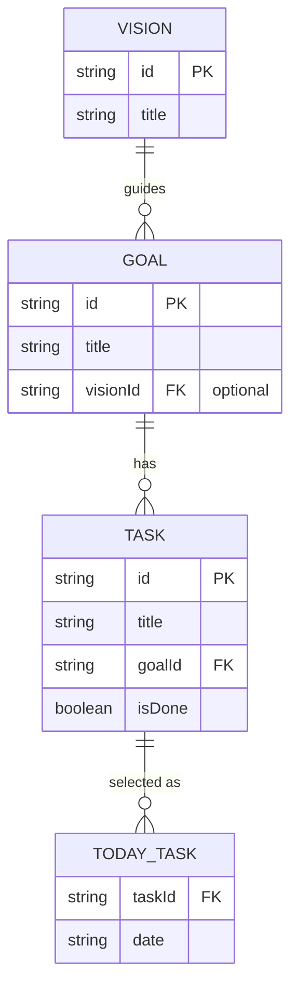

# Vision 階層導入 — 設計ドキュメント

## 概要

現在の `Goal → Task` の2階層を `Vision → Goal → Task` の3階層に拡張する。

| 階層 | 役割 | 例 |
|------|------|-----|
| Vision | 人生の方向性・大きな目的 | 「エンジニアとして自立する」 |
| Goal | Visionを実現するための中期目標 | 「Kubernetesを実務で使えるようになる」 |
| Task | Goalを進めるための日次タスク | 「kubectl の基本コマンドを練習する」 |

---

## データモデル変更

### 現在

```ts
type Goal = {
  id: string
  title: string
}

type Task = {
  id: string
  title: string
  goalId: string
  isDone: boolean
}
```

### 変更後

```ts
// 新規追加
type Vision = {
  id: string
  title: string
}

// visionId を追加（optional: 既存データとの互換性を保つ）
type Goal = {
  id: string
  title: string
  visionId?: string  // 未紐づけの Goal は「未分類」扱い
}

// 変更なし
type Task = {
  id: string
  title: string
  goalId: string
  isDone: boolean
}

// 変更なし
type TodayTask = {
  taskId: string
  date: string
}
```

### ER図



---

## ストア変更

### 新規：visionStore

```ts
interface VisionStore {
  visions: Vision[]
  addVision: (title: string) => void
  deleteVision: (visionId: string) => void  // 紐づく Goal も連鎖削除
}
// persist key: 'suguyaru-visions'
```

### 変更：goalStore

```ts
interface GoalStore {
  goals: Goal[]
  addGoal: (title: string, visionId?: string) => void  // visionId 追加
  deleteGoal: (goalId: string) => void
  deleteGoalsByVisionId: (visionId: string) => void    // 新規追加
}
```

### 連鎖削除の仕様

```
Vision を削除
  └─ 紐づく Goal を全削除
       └─ 紐づく Task を全削除
            └─ 該当 TodayTask を全削除
```

---

## 画面変更

### 新規：Vision 管理画面（`/visions`）

```
> Vision 管理

  Vision 名: [__________________________]
  + 追加する

  ─────────────────────────────────────
  > エンジニアとして自立する  (2 goals)
  > 健康な体を維持する        (1 goal)
```

### 変更：Goal 管理画面（`/goals`）

Vision ごとにグループ化して表示。Goal 作成時に Vision を選択。

```
> Goal 管理

  Vision: [エンジニアとして自立する ▼]  ← カスタムドロップダウン
  Goal 名: [__________________________]
  + 追加する

  ─────────────────────────────────────
  [Vision: エンジニアとして自立する]
  > Kubernetes を実務で使えるようになる  (3 tasks)
  > Git を深く理解する                  (2 tasks)

  [Vision: 未分類]
  > 読書習慣をつける                    (1 task)
```

### 変更：Task 管理画面（`/tasks`）

Vision → Goal の2階層でグループ化。

```
> タスク管理

  Goal: [Kubernetes を実務で... ▼]
  タスク名: [________________________]
  + 追加する

  ─────────────────────────────────────
  [エンジニアとして自立する > Kubernetes を実務で使えるようになる]
  > kubectl 練習
  > Pod 理解

  [エンジニアとして自立する > Git を深く理解する]
  > rebase 練習
```

### 変更：タスク選択画面（`/select`）

Vision → Goal → Task の3階層で表示。

```
> タスクを選ぶ                    2/5 選択中

  [エンジニアとして自立する]
    [Kubernetes を実務で使えるようになる]
    [x] kubectl 練習
    [ ] Service 理解

    [Git を深く理解する]
    [ ] rebase 練習
```

### Today 画面（検討中）

タスクに「Vision > Goal」のコンテキストを薄く表示するか？

**案A：コンテキスト表示あり**
```
  [ ] kubectl 練習
      Kubernetes を実務で... ← Goal 名を薄く表示
```

**案B：コンテキスト表示なし（現状維持）**
```
  [ ] kubectl 練習
```

→ Today の「シンプルさ」が重要なコンセプトなので、**案B（表示なし）を推奨**。
  タスク名に意図が込められているべき。

---

## ナビゲーション変更

```
[ スグヤル ] | Today | Select | Tasks | Goals | Visions
```

Visions を末尾に追加。または Goals 画面内から Visions を管理する形でナビはそのままにする。

→ **独立した `/visions` ページ + ナビに追加** を推奨。
  Vision は最上位概念なので独立させた方が概念が明確になる。

---

## 既存データの移行戦略

`visionId` を optional にすることで破壊的変更なしに移行できる。

| 状況 | 扱い |
|------|------|
| `visionId` が未設定の Goal | 「未分類」グループに表示 |
| 新規 Goal | Vision 選択は任意（未分類でも作成可能） |

localStorage の既存データはそのまま使えるため、**マイグレーションスクリプト不要**。

---

## 影響範囲まとめ

| ファイル | 変更種別 | 内容 |
|---------|---------|------|
| `types/index.ts` | 更新 | `Vision` 型追加、`Goal` に `visionId?` 追加 |
| `stores/visionStore.ts` | 新規 | Vision の CRUD |
| `stores/goalStore.ts` | 更新 | `addGoal` に `visionId?` 追加、`deleteGoalsByVisionId` 追加 |
| `stores/taskStore.ts` | 変更なし | — |
| `stores/todayStore.ts` | 変更なし | — |
| `components/layout/StoreHydration.tsx` | 更新 | `visionStore.persist.rehydrate()` 追加 |
| `components/visions/` | 新規 | `VisionForm`, `VisionItem`, `VisionList` |
| `components/goals/GoalForm.tsx` | 更新 | Vision 選択ドロップダウン追加 |
| `components/goals/GoalList.tsx` | 更新 | Vision グループ表示 |
| `components/goals/GoalItem.tsx` | 更新 | Vision 削除時の連鎖削除対応 |
| `components/tasks/TaskList.tsx` | 更新 | Vision → Goal の2階層グループ表示 |
| `components/select/SelectList.tsx` | 更新 | Vision → Goal → Task の3階層表示 |
| `app/visions/page.tsx` | 新規 | Vision 管理画面 |
| `app/goals/page.tsx` | 更新 | Vision グループ対応 |
| `app/layout.tsx` | 変更なし | — |
| `components/layout/Header.tsx` | 更新 | Visions リンク追加 |

---

## 決定事項

| 項目 | 決定 | 理由 |
|------|------|------|
| Today 画面でコンテキスト（Goal 名）を表示するか | **表示しない** | Today のシンプルさが最重要。タスク名に意図が込められているべき |
| Goal 作成時に Vision の指定を必須にするか | **任意（optional）** | 既存データとの互換性、Vision 未作成でも Goal を作れる柔軟性を優先 |
| Vision の件数に上限を設けるか | **設けない** | 人生の方向性は数件程度が自然で、制約は不要 |
| Vision の並び替え機能は必要か | **初期実装では不要** | シンプルさ優先、必要になったら追加 |
