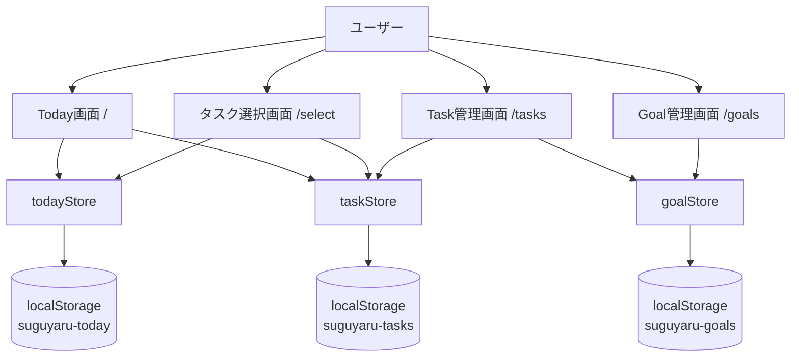
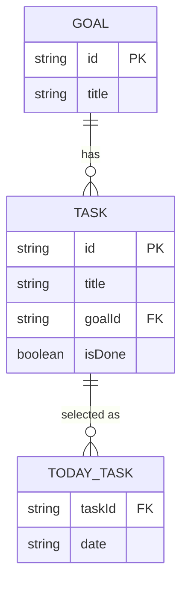
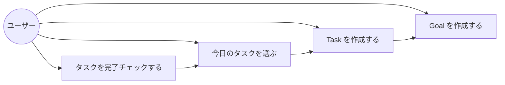
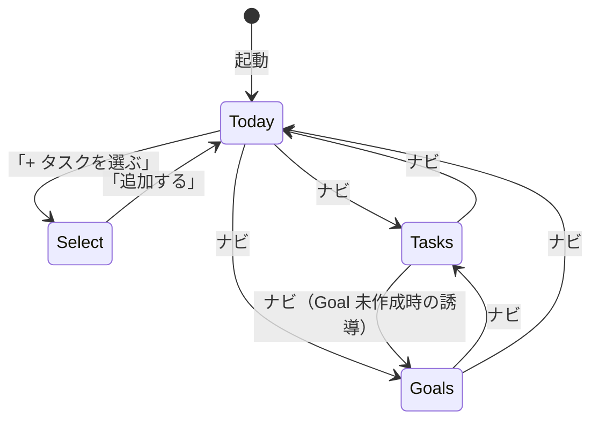

# 機能設計書

## 機能ごとのアーキテクチャ

### 全体構成

```
┌─────────────────────────────────────────────┐
│                  Browser                    │
│                                             │
│  ┌──────────────────────────────────────┐  │
│  │           Next.js App Router         │  │
│  │                                      │  │
│  │  page.tsx → Component → Zustand Store│  │
│  │                    ↕                 │  │
│  │              localStorage            │  │
│  └──────────────────────────────────────┘  │
└─────────────────────────────────────────────┘
```

- サーバーサイド処理なし（全処理はクライアント）
- Zustand store が単一の状態ソース
- `persist` ミドルウェアが localStorage と自動同期

---

## システム構成図



---

## データモデル定義

### 型定義

```ts
type Goal = {
  id: string       // crypto.randomUUID()
  title: string
}

type Task = {
  id: string       // crypto.randomUUID()
  title: string
  goalId: string   // Goal.id への参照
  isDone: boolean
}

type TodayTask = {
  taskId: string   // Task.id への参照
  date: string     // "YYYY-MM-DD"
}
```

### ER図



---

## コンポーネント設計

### コンポーネント階層

```
app/layout.tsx
└── Header
    ├── app/page.tsx（Today）
    │   ├── TodayList
    │   │   └── TodayItem × n
    │   └── LinkButton（→ /select）
    ├── app/select/page.tsx
    │   ├── SelectList
    │   │   └── SelectItem × n（Goal グループ）
    │   └── Button（追加する）
    ├── app/tasks/page.tsx
    │   ├── TaskForm
    │   └── TaskList
    │       └── TaskItem × n（Goal グループ）
    └── app/goals/page.tsx
        ├── GoalForm
        └── GoalList
            └── GoalItem × n
```

### 各コンポーネントの責務

| コンポーネント | 責務 |
|---------------|------|
| `Header` | ナビゲーションリンクの表示・現在ページのハイライト |
| `TodayList` | 今日の TodayTask を取得し TodayItem に渡す |
| `TodayItem` | タスク1件の表示・完了チェックのトグル |
| `SelectList` | 未完了タスクを Goal グループで表示・選択状態を管理 |
| `SelectItem` | タスク1件の選択チェックボックス |
| `TaskForm` | Goal 選択 + タイトル入力で Task を作成 |
| `TaskList` | タスクを Goal グループで一覧表示 |
| `TaskItem` | タスク1件の表示 |
| `GoalForm` | タイトル入力で Goal を作成 |
| `GoalList` | Goal 一覧表示 |
| `GoalItem` | Goal 1件 + タスク件数の表示 |

---

## ユースケース図



---

## 画面遷移図



---

## ワイヤフレーム

### ① Today 画面

```
┌─────────────────────────────────────┐
│ > スグヤル   Today Select Tasks Goals│
├─────────────────────────────────────┤
│                                     │
│ > 今日のタスク (2/5)                │
│                                     │
│   [ ] kubectl 練習                  │
│   [x] Pod 理解                      │
│                                     │
│   + タスクを選ぶ                    │
│                                     │
└─────────────────────────────────────┘
```

### ② タスク選択画面

```
┌─────────────────────────────────────┐
│ > スグヤル   Today Select Tasks Goals│
├─────────────────────────────────────┤
│                                     │
│ > タスクを選ぶ (1/5 選択中)         │
│                                     │
│   [Goal: Kubernetes 学習]           │
│   [x] kubectl 練習                  │
│   [ ] Service 理解                  │
│                                     │
│   [Goal: Git 習得]                  │
│   [ ] rebase 練習                   │
│                                     │
│   ┌──────────┐                      │
│   │  追加する │                      │
│   └──────────┘                      │
└─────────────────────────────────────┘
```

### ③ Task 管理画面

```
┌─────────────────────────────────────┐
│ > スグヤル   Today Select Tasks Goals│
├─────────────────────────────────────┤
│                                     │
│ > タスク管理                        │
│                                     │
│   Goal: [Kubernetes 学習 ▼]         │
│   タスク名: [__________________]    │
│   + 追加する                        │
│                                     │
│   ─────────────────────────         │
│   [Kubernetes 学習]                 │
│   > kubectl 練習                    │
│   > Pod 理解                        │
│                                     │
└─────────────────────────────────────┘
```

### ④ Goal 管理画面

```
┌─────────────────────────────────────┐
│ > スグヤル   Today Select Tasks Goals│
├─────────────────────────────────────┤
│                                     │
│ > Goal 管理                         │
│                                     │
│   Goal 名: [__________________]     │
│   + 追加する                        │
│                                     │
│   ─────────────────────────         │
│   > Kubernetes 学習  (3 tasks)      │
│   > Git 習得         (2 tasks)      │
│                                     │
└─────────────────────────────────────┘
```

---

## API設計

MVP ではバックエンドなし。将来的にバックエンドと連携する場合は以下を想定。

| メソッド | パス | 説明 |
|---------|------|------|
| GET | `/api/goals` | Goal 一覧取得 |
| POST | `/api/goals` | Goal 作成 |
| GET | `/api/tasks` | Task 一覧取得 |
| POST | `/api/tasks` | Task 作成 |
| PATCH | `/api/tasks/:id` | Task 更新（isDone トグル） |
| GET | `/api/today` | 今日の TodayTask 取得 |
| POST | `/api/today` | TodayTask 追加 |
| DELETE | `/api/today/:taskId` | TodayTask 削除 |
